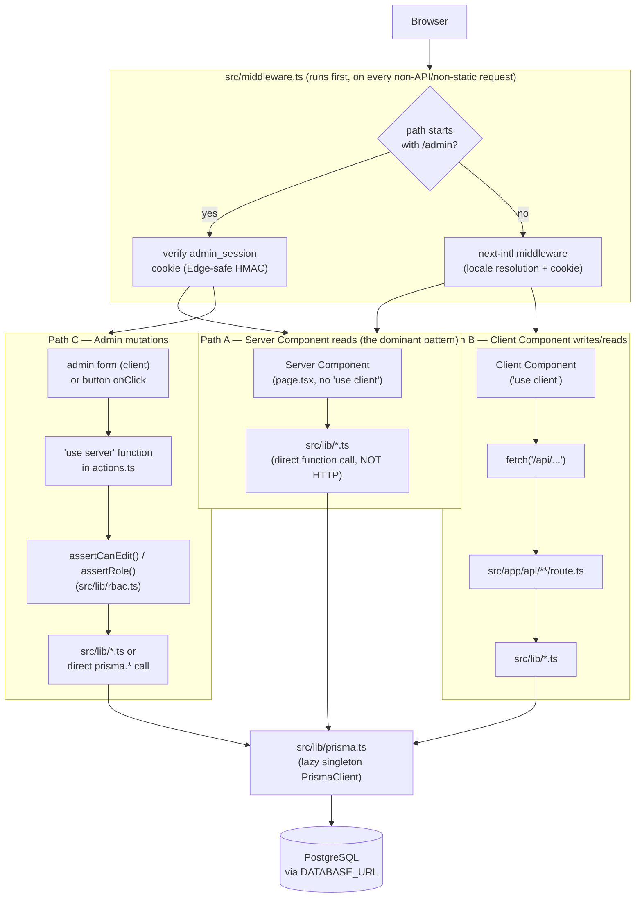
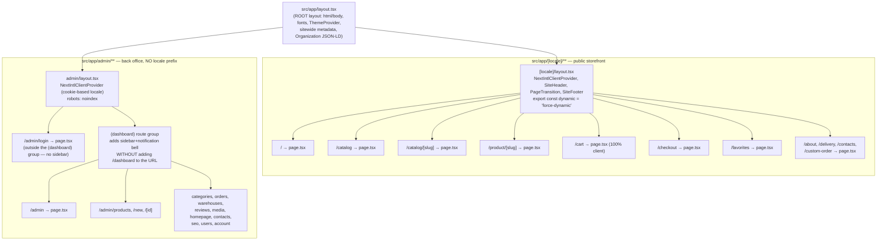
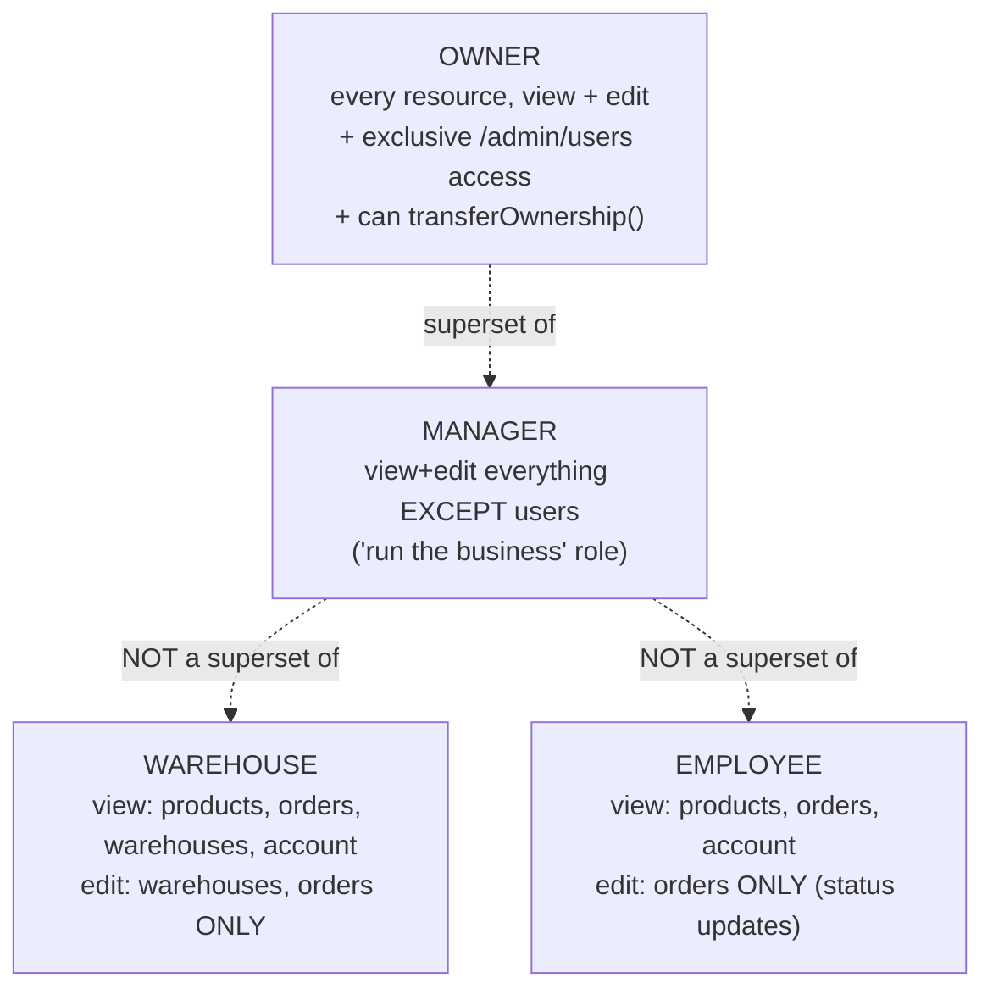
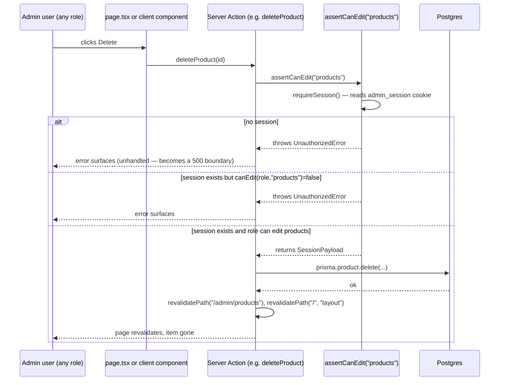
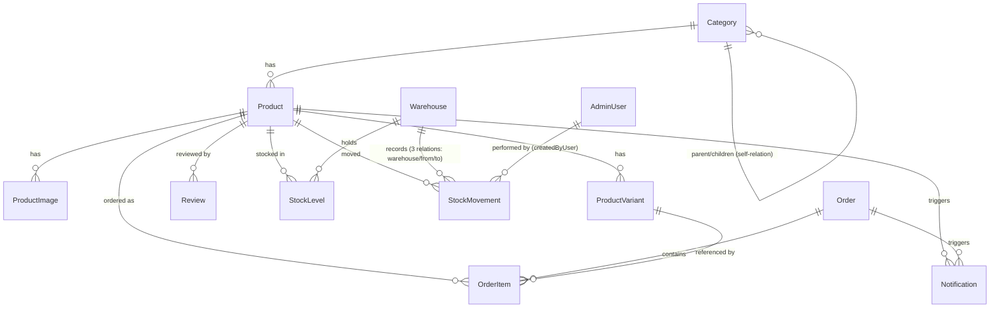
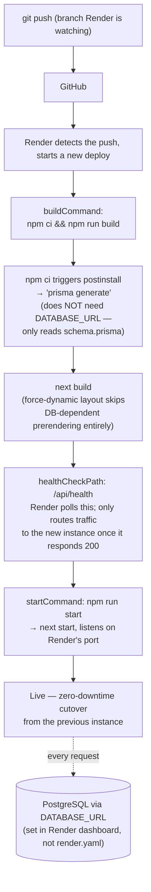
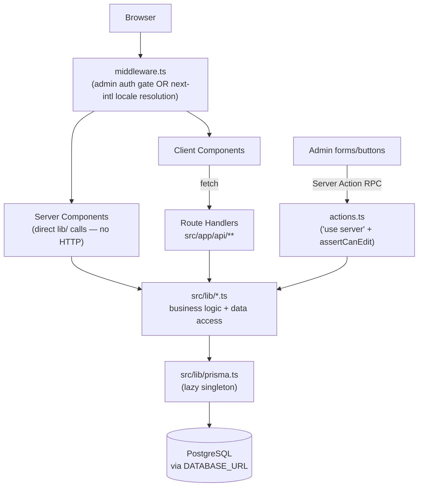

# Light Textiles — Architecture

This document explains **how this specific codebase is actually built**, not how a generic Next.js app works. Every claim here is traceable to a real file in this repo. Where a file is quoted, the path is exact — open it and you'll see exactly what's described.

If you are the next lead developer on this project, read this document top to bottom once, then use it as a reference. It assumes you know React and SQL but have never seen this repo before.

> A companion document, `DEVELOPER_HANDBOOK.md`, already exists in this repo and covers security/performance audit history in detail. This document is the architectural reference; where the two overlap, this one is the source of truth for *current* behavior (some findings in the handbook, e.g. "no caching anywhere," have since been fixed — this document reflects the code as it exists today).

---

## Table of Contents

1. [Overall Architecture](#1-overall-architecture)
2. [Project Structure](#2-project-structure)
3. [Important Files](#3-important-files)
4. [Routing](#4-routing)
5. [Authentication](#5-authentication)
6. [Authorization (RBAC)](#6-authorization-rbac)
7. [Database](#7-database)
8. [API](#8-api)
9. [Admin Panel](#9-admin-panel)
10. [Storefront](#10-storefront)
11. [Rendering](#11-rendering)
12. [Performance](#12-performance)
13. [Security](#13-security)
14. [Deployment](#14-deployment)
15. [Environment Variables](#15-environment-variables)
16. [Development Workflow](#16-development-workflow)
17. [Debugging](#17-debugging)
18. [Future Development](#18-future-development)
19. [Project Maintenance](#19-project-maintenance)
20. [Final Summary](#20-final-summary)

---

## 1. Overall Architecture

### The single most important fact about this codebase

**There is no separate backend.** One Next.js 15 (App Router) application, one Node process, one deployment on Render, serves the public storefront, the `/admin` back office, and every API endpoint. "The API" is just Route Handlers (`src/app/api/**`) and Server Actions (`actions.ts` files) running in the same process as the pages. There is no Express server, no NestJS, no separate repo.

**There is no Supabase SDK anywhere in this code.** The task brief that requested this document assumed a `Prisma → Supabase PostgreSQL` flow. Grep the repo: there is no `@supabase/*` package in `package.json`, no Supabase client, no Supabase-specific API call anywhere. What actually exists is `prisma/schema.prisma`'s `datasource db { provider = "postgresql" }`, reading a single `DATABASE_URL` connection string. That connection string *might* point at a Supabase-hosted Postgres instance in production — but that would be an operational choice made in the Render dashboard, invisible to and unassumed by the code. Whatever Postgres provider it points at (Render's own managed Postgres, Supabase, Neon, a VPS) the code behaves identically. Verify the real target by checking the `DATABASE_URL` value in the Render dashboard, not by reading source.

### The three real request paths

This is the part a generic explanation gets wrong. There isn't one linear pipe from browser to database — there are **three distinct paths**, and knowing which one a piece of code uses tells you everything about how it behaves:



**Path A — Server Component → `lib/` → Prisma (direct function call, not HTTP).** This is the dominant pattern. `src/app/[locale]/product/[slug]/page.tsx` is an `async function` React Server Component. It calls `getProductBySlug(slug)` from `src/lib/products.ts` **as a plain in-process async function call** — there is no network hop, no fetch, no serialization boundary. The function runs on the server, awaits `prisma.product.findFirst(...)`, and the resolved data flows straight into JSX that gets rendered to HTML on the server. The browser never sees this call happen; it only receives finished HTML (plus a React "Flight" payload for hydration).

**Path B — Client Component → `fetch("/api/...")` → Route Handler → `lib/`.** Used only where a component *must* run in the browser and needs server data after the initial page load: the favorites page (`src/app/[locale]/favorites/page.tsx`, `"use client"`) reads favorited product IDs from `localStorage` via Zustand, then calls `fetch("/api/products/by-ids?ids=...")` to hydrate full product data; the checkout form posts to `/api/orders/checkout`; the admin notification bell polls `/api/admin/notifications` every 15 seconds; the admin media uploader posts files to `/api/admin/upload`. This *is* a real HTTP round-trip, JSON in and out.

**Path C — Admin mutation → Server Action → RBAC guard → Prisma.** Every admin create/update/delete/toggle is a function with `"use server"` at the top of an `actions.ts` file (e.g. `src/app/admin/(dashboard)/products/actions.ts::createProduct`). These are invoked either directly as a form's `action` prop or as a normal async function call from a client component's `onClick`. Next.js handles the client→server RPC transparently (it's still an HTTP POST under the hood, but you never write `fetch` or define a route — Next's bundler generates the wire-up). **Every single one of these starts with an `assertCanEdit(resource)` or `assertRole(...)` call from `src/lib/rbac.ts`, before touching Prisma.** This is the real security boundary — not the UI, not the sidebar, not `middleware.ts`.

### What "Prisma → Postgres" actually looks like in code

```ts
// src/lib/prisma.ts — the ONLY PrismaClient instance in the whole app
export const prisma = new Proxy({} as PrismaClient, {
  get(_target, prop, receiver) {
    const client = getClient(); // lazily calls `new PrismaClient()` on first real use
    const value = Reflect.get(client as object, prop, receiver);
    return typeof value === "function" ? value.bind(client) : value;
  },
});
```

This is a `Proxy`, not a plain `PrismaClient` instance, for one specific reason explained in the file's own comment: **`next build` executes every page module to statically analyze it, and Render's build environment has no `DATABASE_URL`.** A plain `new PrismaClient()` at module scope would try to read `DATABASE_URL` the instant the module is imported — at build time — and crash the build. The `Proxy` defers actual client construction until the first property access (`prisma.product.findMany(...)`), which only happens at *request* time, when `DATABASE_URL` is guaranteed to exist. Every `lib/*.ts` file imports this same `prisma` export; there is exactly one client instance per running process (stored on `globalThis` to survive Next.js's dev-mode hot-reload without leaking connections).

---

## 2. Project Structure

```
light-textiles/
├── prisma/
│   ├── schema.prisma       — the single source of truth for every DB table (see §7)
│   ├── migrations/          — 3 applied migrations: init, add_contact_request, add_rbac_warehouses_notifications
│   ├── seed.ts               — one-time script: imports scraped catalog data + creates the OWNER account
│   └── seed-data/             — raw JSON the seed script reads
├── public/
│   ├── brand/                  — logo assets (logo-mark.svg, logo-mark-1024.png, logo-mark-mono.svg)
│   ├── images/                  — hand-placed marketing images (hero-fabric.jpg, about-fabric.jpg)
│   └── uploads/
│       ├── products/              — images written once by prisma/seed.ts
│       └── media/                  — images written at RUNTIME by the admin Media Library uploader
├── messages/
│   ├── uk.json, en.json, ru.json  — every UI string, storefront AND admin, in one file per locale
├── scripts/
│   ├── backup-db.sh                — npm run db:backup (pg_dump wrapper)
│   ├── restore-db.sh                — npm run db:restore (pg_restore wrapper)
│   └── export-demo-data.ts           — DEAD CODE, see §3
├── src/
│   ├── app/
│   │   ├── [locale]/                 — public storefront, every route locale-prefixed (see §4)
│   │   ├── admin/                     — back office, NOT locale-prefixed, own auth gate
│   │   ├── api/                        — Route Handlers (Path B above)
│   │   ├── layout.tsx                   — ROOT layout (html/body, fonts, theme, sitewide metadata)
│   │   ├── robots.ts, sitemap.ts         — generated, not static files
│   │   ├── not-found.tsx, error.tsx,      — root-level fallback boundaries
│   │   │   global-error.tsx
│   │   └── middleware.ts                   — actually lives at src/middleware.ts, see below
│   ├── components/
│   │   ├── home/                       — homepage sections (Hero, Advantages, Reviews, Faq, ...)
│   │   ├── product/                     — ProductCard, ProductGallery, ProductPurchasePanel, StockByWarehouse
│   │   ├── catalog/                      — CatalogToolbar (sort/filter), CatalogPagination
│   │   ├── admin/                         — admin-only UI: sidebar, forms, notification bell
│   │   ├── layout/                         — SiteHeader/SiteFooter, locale switcher, page transitions
│   │   ├── ui/                              — generic primitives: Button, Input, Textarea, Card, PageHero, Reveal
│   │   ├── brand/                            — <LogoMark />
│   │   └── icons/                             — hand-drawn social icons (Facebook, Instagram)
│   ├── lib/                             — ALL data access + business logic + cross-cutting concerns (table below)
│   ├── i18n/                            — next-intl configuration (see §4)
│   ├── stores/                          — Zustand client state: cart, favorites
│   └── middleware.ts                     — runs on (almost) every request, see §4
├── next.config.ts                      — next-intl plugin, image config, security headers, build hardening
├── render.yaml                          — Render Blueprint: build/start commands, plan, region, health check
├── .env.example                          — documents every environment variable this app reads
└── DEVELOPER_HANDBOOK.md                  — security/performance audit history (companion doc)
```

There is **no** `hooks/`, `middleware/` (plural), `styles/`, `types/`, or `utils/` top-level folder in this project — those are common Next.js conventions elsewhere, but this repo doesn't use them. Cross-cutting logic lives in `src/lib/`; there's a single `src/middleware.ts` file (not a folder); type definitions live inline or are imported from `@prisma/client` (Prisma generates TypeScript types from `schema.prisma` automatically — there's no hand-written `types/` folder because most domain types *are* the Prisma-generated ones); global styles live in `src/app/globals.css`, not a `styles/` folder.

### `src/lib/` — every file, what it's for, who calls it

| File | Purpose | Called from |
|---|---|---|
| `prisma.ts` | The one lazy `PrismaClient` singleton (explained above) | every other `lib/*.ts` file, every `actions.ts`, every `route.ts` |
| `session.ts` | `getSession()`, `setSessionCookie()`, `clearSessionCookie()` — Node-runtime cookie read/write | `auth-actions.ts`, every admin page/action that needs the current admin user |
| `session-token.ts` | Hand-rolled signed-token sign/verify using Web Crypto (Edge-compatible, see §5) | `session.ts` (Node) AND `middleware.ts` (Edge) — the one file both runtimes share |
| `rbac.ts` | `requireSession`, `assertRole`, `assertCanEdit`, `requireView` — the actual enforcement functions | every `actions.ts`, every admin `page.tsx` that needs a view-gate, `/api/admin/upload` |
| `rbac-policy.ts` | `NAV_ACCESS` / `EDIT_ACCESS` tables — pure data, which role can view/edit which resource | `rbac.ts`, `admin-sidebar.tsx` (to decide which links to render) |
| `role-label.ts` | Maps `AdminRole` enum value → i18n message key | staff list/forms that display a role name |
| `admin-locale.ts` | Reads/writes the admin panel's own locale (cookie-based, independent of the storefront's URL-based locale) | `admin/layout.tsx`, `admin/locale-actions.ts`, `not-found.tsx` for admin |
| `categories.ts` | `getCategoryTree()` (nav/catalog tree), `getPopularCategories()` (homepage widget) — both `unstable_cache`-wrapped | `SiteHeader`, `SiteFooter`, `/catalog`, `/catalog/[slug]`, `PopularCategories` |
| `products.ts` | `getCategoryBySlug`, `getProductsForCategoryIds`, `getProductBySlug`, `toProductCardData`, shared `productCardSelect` | catalog pages, product page, `/api/products/by-ids` |
| `homepage-content.ts` | `getActiveBanners`, `getActiveFaqItems`, `getApprovedReviews` — `unstable_cache`-wrapped | `PromoBanners`, `Faq`, `Reviews` homepage sections |
| `orders.ts` | `generateOrderNumber()`, `createOrder()` — the ONE place an `Order` gets written, re-derives prices server-side | `/api/orders/checkout`, `/api/orders/quick` |
| `notifications.ts` | `notifyNewOrder()`, `maybeNotifyLowStock()` — writes `Notification` rows | `orders.ts`, `warehouses/actions.ts` |
| `site-settings.ts` | `getSiteSettings()` — `unstable_cache`-wrapped, hardcoded fallback if the `SiteSettings` row doesn't exist yet | `SiteHeader`, `SiteFooter`, `ContactSection`, `/about`, `/delivery` |
| `seo.ts` | `SITE_URL`, `OG_LOCALE`, `getAlternates()` (hreflang/canonical builder) | every page's `generateMetadata`, root `layout.tsx` |
| `get-localized.ts` | Picks the right language string out of a `{uk,en,ru}` JSON blob | everywhere a `Product.name`/`Category.name`/etc. is rendered |
| `slugify.ts` | Cyrillic → Latin transliteration + URL-safe slug generation | `products/actions.ts`, `categories/actions.ts` |
| `upload.ts` | `saveUploadedFile()` — validates + writes to `public/uploads/media/`, creates a `MediaAsset` row | `/api/admin/upload` |
| `rate-limit.ts` | In-memory sliding-window limiter, `checkRateLimit()` + `getClientIp()` | `auth-actions.ts` (login), `/api/contact`, `/api/orders/checkout`, `/api/orders/quick` |
| `utils.ts` | `cn()` (clsx+tailwind-merge class composition), `formatPrice()` | almost every component |
| `validation/contact.ts`, `validation/order.ts` | Zod schemas — the actual trust boundary for public form input | client forms (`zodResolver`) AND the matching API route (`.safeParse`) |
| `use-overlay-a11y.ts` | Shared hook: scroll lock + Escape-to-close + focus trap for any overlay | admin mobile sidebar, mobile nav drawer, quick-order modal |
| `demo-store.ts` | **Dead code.** Zero importers anywhere in `src/`. Left over from a since-reverted "static demo" experiment (see git history: commit `1552b1f` then `38b0406` reverted it back to Postgres without deleting this file). Its own `AdminRole` type includes `"STAFF"`, which **does not exist** in the real schema — never treat this file as a source of truth. | nothing |

---

## 3. Important Files

### `src/middleware.ts`

**Why it exists:** the single choke point every request (except static assets/API routes, per its `matcher`) passes through before any page renders. It does two unrelated jobs depending on the path: admin auth/role gating, or delegating to next-intl's locale-resolution middleware.

**When it runs:** on the Edge runtime, before the Node server even starts rendering a route. This is *why* `session-token.ts` is hand-rolled with Web Crypto instead of a library like `jsonwebtoken` — Prisma cannot run on Edge, and most JWT libraries assume a Node crypto module. Verifying a signed cookie here would otherwise be impossible without a database round-trip.

**Who uses it:** every browser request implicitly. No code imports it directly — Next.js discovers and runs it automatically because it's named `middleware.ts` at the `src/` root.

**What breaks if removed:** `/admin/**` becomes completely unauthenticated (anyone could open `/admin/products` with no login) AND the storefront's locale routing (`/en/catalog`, the `NEXT_LOCALE` cookie, default-locale prefix stripping) stops working entirely.

### `src/lib/prisma.ts`

Covered in §1. **What breaks if removed:** every single database call in the entire app fails to compile (every `lib/*.ts`, every `actions.ts`, every `route.ts` imports `{ prisma }` from here).

### `src/lib/session-token.ts` and `src/lib/session.ts`

**Why two files:** `session-token.ts` contains only pure crypto (sign/verify), runnable on both Node and Edge. `session.ts` wraps it with `next/headers`' `cookies()` API, which is Node-only (Server Components/Actions/Route Handlers). `middleware.ts` imports `session-token.ts` directly (Edge-safe); everything else imports `session.ts`.

**What breaks if removed:** admin login is completely broken — `adminLogin()` in `auth-actions.ts` can't create a session, `middleware.ts` can't verify one.

### `prisma/schema.prisma`

**Why it exists:** the single source of truth for the database shape. Prisma's code generator (`prisma generate`, run automatically via `package.json`'s `"postinstall"` script on every `npm install`) reads this file and produces the fully-typed `PrismaClient` API (`prisma.product.findMany(...)`, etc.) that the rest of the app imports from `@prisma/client`.

**When it "runs":** it doesn't run — it's a spec. `prisma generate` reads it at install/build time; `prisma migrate dev`/`migrate deploy` diff it against the live database and apply/generate SQL migrations.

**What breaks if removed:** nothing compiles. `@prisma/client`'s generated types disappear, every Prisma call in the codebase becomes a type error, and there is no way to talk to Postgres at all.

### `next.config.ts`

**Why it exists:** wires the `next-intl` plugin into the build, configures `next/image` (remote patterns, AVIF/WebP formats), sets production-hardening flags (`poweredByHeader: false`, `reactStrictMode: true`, `outputFileTracingRoot`), and defines the `headers()` function that adds security headers (X-Frame-Options, HSTS, etc.) plus long-lived caching for `/uploads/**`.

**What breaks if removed:** `next-intl` stops working (no locale message loading), `next/image` can't optimize remote/local images correctly, no security headers are sent, no long-lived cache headers on uploaded media.

### `render.yaml`

**Why it exists:** Render's "Blueprint" spec — defines the entire deploy configuration as code (build command, start command, plan, region, health check path) instead of requiring manual dashboard clicks.

**What breaks if removed:** Render falls back to whatever is manually configured in its dashboard (if anything) — the repo loses its self-documenting, reproducible deploy config.

### `messages/{uk,en,ru}.json`

**Why they exist:** every UI string in the entire app — storefront *and* admin — lives here, not hardcoded in components. This is why translating or rewording anything is a JSON edit, never a code change.

**What breaks if removed:** every `useTranslations()`/`getTranslations()` call throws (missing message key), which means essentially every page in the app fails to render.

### `.env` / `.env.example`

**Why `.env.example` exists (and is committed) while `.env` is not:** `.env.example` documents which variables the app needs with placeholder/empty values, safe to commit. `.env` holds real secrets and is `.gitignore`d (confirmed: `git log --all` shows no history for it — it has never been committed).

**What breaks if `.env` is missing locally:** `npm run dev`/`build` still start (see the `prisma.ts` lazy-Proxy explanation), but any code path touching the database or admin session throws the moment it's exercised.

---

## 4. Routing

Two independent route trees share this one Next.js app.



### `[locale]` dynamic segment routing

`src/app/[locale]/layout.tsx` calls `generateStaticParams()` returning `uk`/`en`/`ru`, and `next-intl`'s `routing.ts` config sets `localePrefix: "as-needed"`. That means:

- The default locale (`uk`) has **no URL prefix**: `/catalog`, `/product/naволочка-50x70`.
- Non-default locales get a prefix: `/en/catalog`, `/ru/product/...`.

This is resolved by `intlMiddleware` (from `createMiddleware(routing)` in `src/i18n/routing.ts`), invoked at the bottom of `src/middleware.ts` for every non-`/admin` path. It reads/writes a `NEXT_LOCALE` cookie (1-year `maxAge`) so a visitor's chosen locale persists across visits even when they land on a prefix-less URL.

**Always import `Link` from `@/i18n/navigation`, never `next/link`, on storefront pages** — that's a thin wrapper (`createNavigation(routing)` in `src/i18n/navigation.ts`) that automatically adds the correct locale prefix. Using plain `next/link` would silently break locale-aware navigation.

### Admin routing — the `(dashboard)` route group

`src/app/admin/(dashboard)/` is a **route group** (parentheses in the folder name are stripped from the URL). Every page inside it automatically gets the shared chrome defined in `src/app/admin/(dashboard)/layout.tsx` (the sidebar + notification bell) without `/dashboard` ever appearing in a URL. `src/app/admin/login/page.tsx` sits *outside* that group specifically so the login screen renders without the sidebar (you're not authenticated yet, there's nothing to navigate to).

### Protected routes — where the actual gate is

There are **two layers**, and they don't overlap perfectly — understanding the gap between them matters:

1. **`src/middleware.ts`** — coarse, path-prefix-based. Any request to `/admin/**` (except `/admin/login`) with no valid session cookie gets redirected to `/admin/login`. `/admin/users/**` additionally requires `role === "OWNER"`; `/admin/warehouses/**` requires `OWNER`/`MANAGER`/`WAREHOUSE`. Every *other* `/admin/**` path is reachable by **any** signed-in role at this layer — a `WAREHOUSE` account can load `/admin/seo` past the middleware.
2. **`requireView(resource)`** (`src/lib/rbac.ts`), called at the top of the relevant `page.tsx` Server Components (`seo`, `homepage`, `categories`, `contacts`, `reviews`, `media`, and defensively on `warehouses` too) — this is what actually stops that `WAREHOUSE` account, redirecting to `/admin` if `canView(role, resource)` is false.

`products`, `orders`, and `account` pages have **no** `requireView` call — that's intentional, those three resources are visible to all four roles per `NAV_ACCESS` (see §6), so there's nothing to gate.

### Dynamic segments in this app

| Route | Param | Resolved by |
|---|---|---|
| `/[locale]/catalog/[slug]` | category slug | `getCategoryBySlug(slug)` in `products.ts` |
| `/[locale]/product/[slug]` | product slug | `getProductBySlug(slug)` in `products.ts` |
| `/admin/products/[id]`, `/admin/categories/[id]`, `/admin/orders/[id]`, `/admin/warehouses/[id]`, `/admin/users/[id]` | database `id` (cuid) | direct `prisma.*.findUnique({ where: { id } })` in each page |

None of the storefront dynamic routes use `generateStaticParams()` for products/categories (only the outer `[locale]` segment does) — every product/category page is rendered fresh per request, a direct consequence of `force-dynamic` on `[locale]/layout.tsx` (see §11 for the full explanation of why, and what's cached anyway).

---

## 5. Authentication

Authentication is entirely hand-built — no NextAuth/Auth.js, no external identity provider. It's a signed, stateless cookie.

### Sequence diagram — login

```mermaid
sequenceDiagram
    participant B as Browser
    participant P as /admin/login (Client Component)
    participant A as adminLogin() Server Action
    participant RL as rate-limit.ts
    participant DB as Postgres (AdminUser)
    participant S as session.ts / session-token.ts

    B->>P: submit email + password
    P->>A: adminLogin(email, password)
    A->>RL: checkRateLimit("login:<email>", 5, 15min)
    alt too many attempts
        RL-->>A: false
        A-->>P: { error: "rate_limited" }
        P-->>B: shows generic "invalid credentials"\n(no info leak about rate limiting)
    else within limit
        RL-->>A: true
        A->>DB: findUnique({ where: { email } })
        alt user not found OR isActive=false
            DB-->>A: null / inactive
            A-->>P: { error: "invalid" }
        else user found
            DB-->>A: AdminUser row
            A->>A: bcrypt.compare(password, passwordHash)
            alt wrong password
                A-->>P: { error: "invalid" }
            else correct password
                A->>S: setSessionCookie({id, email, name, role})
                S->>S: createSessionToken() — HMAC-SHA256 sign,\n7-day expiry, base64url encode
                S-->>B: Set-Cookie: admin_session=<payload>.<sig>\nhttpOnly, sameSite=lax, secure (in prod)
                A-->>P: {} (no error)
                P->>B: router.push("/admin"); router.refresh()
            end
        end
    end
```

### Session token format

`src/lib/session-token.ts` builds `base64url(JSON payload).base64url(HMAC-SHA256 signature)` — a hand-rolled equivalent of a JWT, using the Web Crypto API (`crypto.subtle`) specifically because that API is available in **both** the Node runtime (Server Actions, Route Handlers) and the **Edge runtime** middleware executes in. Prisma cannot run on Edge, so this design lets `middleware.ts` verify a session's validity (signature + expiry) without any database round-trip.

```ts
export type SessionPayload = {
  id: string;
  email: string;
  name: string;
  role: AdminRole;
  exp: number; // unix seconds
};
```

`SESSION_SECRET` (env var) is the HMAC key. `verifySessionToken()` recomputes the signature from the payload and compares it to the one in the cookie; if they don't match, or `exp` has passed, or the token is malformed, it returns `null` — never throws for bad input, only for a missing `SESSION_SECRET` entirely (`getSecret()` throws immediately in that case, breaking admin auth loudly rather than silently).

### Cookie attributes (`src/lib/session.ts`)

```ts
cookieStore.set(SESSION_COOKIE_NAME, token, {
  httpOnly: true,                                    // JS can't read it — mitigates XSS token theft
  sameSite: "lax",                                     // not sent on cross-site POST — mitigates CSRF
  secure: process.env.NODE_ENV === "production",        // HTTPS-only in prod
  maxAge: SESSION_MAX_AGE,                                // 7 days
  path: "/",
});
```

### Logout

`adminLogout()` in `src/lib/auth-actions.ts` calls `clearSessionCookie()` (deletes the cookie) and `redirect("/admin/login")`. There is **no server-side session store to invalidate** — because the token is stateless/self-verifying, the *only* way a token stops working before its 7-day expiry is if the cookie itself is deleted client-side. If someone's session cookie is copied elsewhere, it remains valid until it expires, even after that person "logs out" on the original device. This is a known, documented limitation (see `DEVELOPER_HANDBOOK.md` §15) — fixing it requires a schema migration to add a per-user session version/timestamp checked on every `verifySessionToken()` call.

### Where session state is read

`getSession()` (`src/lib/session.ts`) is called at the top of admin `page.tsx` files that need to know who's logged in (e.g. the dashboard checks `session?.role === "OWNER"` to decide whether to show revenue figures), inside every `actions.ts` function transitively via `assertRole`/`assertCanEdit`, and in `/api/admin/notifications` and `/api/admin/upload` (Route Handlers, which `middleware.ts`'s matcher explicitly excludes — see §4 — so they re-check the session themselves).

---

## 6. Authorization (RBAC)

Four roles, defined once as an enum in `prisma/schema.prisma`:

```prisma
enum AdminRole {
  OWNER
  MANAGER
  WAREHOUSE
  EMPLOYEE
}
```

**Roles are not a linear hierarchy.** `MANAGER` is not "OWNER minus one privilege," and `WAREHOUSE`/`EMPLOYEE` have genuinely different, non-overlapping capability sets. The entire policy is two plain data tables in `src/lib/rbac-policy.ts`:

```ts
export const NAV_ACCESS: Record<AdminRole, Resource[]> = {
  OWNER:     ALL_RESOURCES, // products, categories, orders, warehouses, users, media, homepage, reviews, seo, contacts, account
  MANAGER:   ["products","categories","orders","warehouses","media","homepage","reviews","seo","contacts","account"],
  WAREHOUSE: ["products","orders","warehouses","account"],
  EMPLOYEE:  ["products","orders","account"],
};

export const EDIT_ACCESS: Record<AdminRole, Resource[]> = {
  OWNER:     ALL_RESOURCES,
  MANAGER:   ["products","categories","orders","warehouses","media","homepage","reviews","seo","contacts"], // no "users"
  WAREHOUSE: ["warehouses","orders"],
  EMPLOYEE:  ["orders"],
};
```

`NAV_ACCESS` = can *see* this resource (used to decide what to show in the sidebar, and by `requireView()` to gate a page). `EDIT_ACCESS` = can *mutate* this resource (checked by `assertCanEdit()` inside every Server Action). `canView(role, resource)` / `canEdit(role, resource)` are pure lookups against these tables — that's the entire policy engine, no external library.



### The permission flow for every admin write



**This check happens in every single one of the 10 `actions.ts` files, with no exceptions** — verified directly by reading all of them: `products`, `categories`, `orders`, `warehouses`, `reviews`, `homepage`, `contacts`, `seo`, `media`, `users`. The sidebar filtering (`canView()` in `admin-sidebar.tsx`) is a UX nicety only — hiding a link doesn't stop a signed-in `EMPLOYEE` from typing `/admin/seo` into the address bar. What actually stops them is `requireView("seo")` at the top of `src/app/admin/(dashboard)/seo/page.tsx`, which `redirect("/admin")`s if `canView(role, "seo")` is false.

### `/admin/users` — the one hard-coded exception

Staff management (`createStaffUser`, `updateStaffUser`, `toggleStaffActive`, `deleteStaffUser`, `transferOwnership`) doesn't use `assertCanEdit("users")` — it uses `assertRole("OWNER")` directly (wrapped in `assertOwner()` inside `users/actions.ts`, which also translates the error into a localized message). This is enforced **twice**: once in `middleware.ts`'s `ROUTE_ROLES` table (redirects non-OWNER away from `/admin/users/**` before the page even renders) and again inside every action (defense in depth — if the middleware gate were ever misconfigured, the action-level check still holds).

`transferOwnership(targetId)` is worth understanding specifically: it's a single Prisma transaction that promotes the target to `OWNER` **and** demotes the caller to `MANAGER` in the same atomic operation — there is deliberately no state where two accounts are simultaneously `OWNER`, and no code path lets a user demote/deactivate/delete their own account (`toggleStaffActive`/`deleteStaffUser`/`transferOwnership` all no-op if `session.id === targetId`).

---

## 7. Database

PostgreSQL, accessed exclusively through Prisma. 17 models across 6 enums.



### Every model — purpose, relations, who writes it

| Model | Purpose | Key indexes | Written by | Read by |
|---|---|---|---|---|
| **AdminUser** | Back-office operator (email/passwordHash/role/isActive) | `@unique(email)` | `prisma/seed.ts` (initial OWNER), `users/actions.ts` | `auth-actions.ts` (login), `session.ts`-derived checks everywhere |
| **Category** | Catalog taxonomy, self-referential tree via `parentId` | `@index(parentId)` | `categories/actions.ts` | catalog nav/pages, homepage popular-categories |
| **Product** | Sellable item — localized name/description (`Json`), price, availability, visibility/featured flags | `@index(categoryId)`, `@index([categoryId, isVisible])` (composite — see the schema's own comment: every public query filters both together, so this index alone satisfies it) | `products/actions.ts`, `prisma/seed.ts` | catalog grid, product page, homepage featured section, cart/checkout snapshots |
| **ProductImage** | One ordered gallery image | `@index(productId)` | `products/actions.ts` (full `deleteMany`+recreate on every product update — see §16) | gallery, cards, cart thumbnails |
| **ProductVariant** | Named size/price option (e.g. "Наволочка 50x70") | `@index(productId)` | `products/actions.ts` | variant picker, order line snapshot |
| **Warehouse** | A physical stock location | — | seeded once (`radomyshl`, `horenychi`), not editable via UI beyond stock movements | product page "stock by warehouse", `/admin/warehouses` |
| **StockLevel** | Current quantity of one product at one warehouse | `@@unique([productId, warehouseId])`, `@index(warehouseId)` | `warehouses/actions.ts` (`recordIncoming`/`recordOutgoing`/`transferStock`/`adjustStock`, all inside `prisma.$transaction`) | product page, low-stock dashboard widget |
| **StockMovement** | Immutable audit log of every stock change | `@index` on `productId`, `warehouseId`, `fromWarehouseId`, `toWarehouseId` | `warehouses/actions.ts` — never updated or deleted, append-only | `/admin/warehouses/[id]` movement history |
| **Order** | A customer order — contact/delivery info, status, total | `@index(status)` | `lib/orders.ts::createOrder()` only | `/admin/orders`, `/admin/orders/[id]`, dashboard |
| **OrderItem** | One line item, with a **price snapshot** frozen at order time | `@index(orderId)`, `@index(productId)` | `lib/orders.ts::createOrder()` | order detail page |
| **Review** | Customer testimonial, optionally tied to a product | `@index(productId)`, `@index(isApproved)` | `reviews/actions.ts` — **admin-authored only**, `createReview` always sets `isApproved: true`, `productId: null`. There is no public review-submission form anywhere in this codebase. | homepage Reviews section, `/admin/reviews` |
| **SiteSettings** | Singleton row (`id` hardcoded to `"main"`) — contact info, hero/about/delivery copy, global SEO defaults | — | `contacts/actions.ts`, `homepage/actions.ts`, `seo/actions.ts` | header/footer, homepage, `/about`, `/delivery`, metadata |
| **Banner** | Homepage promo banner (image + optional link) | — | `homepage/actions.ts` | `PromoBanners` |
| **FaqItem** | One Q&A pair | — | `homepage/actions.ts` | `Faq` section |
| **ContactRequest** | A submission from the public contact/custom-order form | — | `/api/contact` (public, unauthenticated) | **nothing currently reads these back** — no admin UI exists for this model despite `/admin/contacts` existing (that page is actually the site-wide *settings* editor, a different thing entirely; see §9). This is a real, documented gap. |
| **MediaAsset** | Metadata for an uploaded file | — | `/api/admin/upload` → `lib/upload.ts` | `/admin/media` grid, used as an image-picker source in product/category/banner forms |
| **Notification** | In-app alert (`NEW_ORDER`/`LOW_STOCK`), targeted at specific roles via `audienceRoles: AdminRole[]` | `@index(createdAt)` | `lib/notifications.ts` | `NotificationBell` (polled via `/api/admin/notifications`) |

### Enums

`AdminRole` (OWNER/MANAGER/WAREHOUSE/EMPLOYEE), `Availability` (IN_STOCK/OUT_OF_STOCK/ON_ORDER), `StockMovementType` (INCOMING/OUTGOING/TRANSFER/ADJUSTMENT), `OrderStatus` (NEW → CONFIRMED → PACKING → SHIPPING → COMPLETED, or CANCELLED), `PaymentMethod` (CASH_ON_DELIVERY/CARD_ONLINE/BANK_TRANSFER), `NotificationType` (NEW_ORDER/LOW_STOCK).

### The localization convention

Anywhere content is customer-facing and translatable, the column is a Prisma `Json` field shaped `{ uk: string, en: string, ru: string }` — **not** separate columns, **not** a translations table. Read through `getLocalized(value, locale)` (`src/lib/get-localized.ts`), which falls back to `uk`, then to whatever's first in the object, if the requested locale key is missing. This is why `Product.name`, `Category.name`, `SiteSettings.workingHours`, `Banner.title`, `FaqItem.question`/`answer`, etc. are all typed `Json` in the schema.

### The one raw SQL query in the entire app

`src/app/admin/(dashboard)/page.tsx` (dashboard low-stock widget) uses `prisma.$queryRaw` with a **fully static tagged template, zero interpolated values** — joins `StockLevel`/`Product`/`Warehouse`, filters `quantity <= lowStockThreshold`, something the Prisma query builder can't express directly (a column-to-column comparison across a join). It poses no injection risk since nothing is interpolated. Every other database access in the app goes through Prisma's query builder.

### Migrations

3 applied: `init`, `add_contact_request`, `add_rbac_warehouses_notifications`, stored in `prisma/migrations/`. **Migrations are not part of the deploy pipeline** — `render.yaml` does not run `prisma migrate deploy`. This is a deliberate, currently-manual step (see §14 and §16 for exactly how to run it).

---

## 8. API

Every Route Handler lives under `src/app/api/**`. All of them are thin: parse input (Zod for the public ones), delegate to `lib/`, return `NextResponse.json(...)`. None of them are covered by `middleware.ts`'s auth gate (its `matcher` explicitly excludes `/api`), so any route needing auth re-checks `getSession()` itself.

| Endpoint | Method | Auth | Request body | Response | Validation | Rate limit |
|---|---|---|---|---|---|---|
| `/api/health` | GET | none | — | `{status:"ok"}` 200, or `{status:"error"}` 503 | — | none |
| `/api/contact` | POST | none | `{name, phone, email?, message}` | `{ok:true}` 200 or `{error}` 400 | `contactRequestSchema` (Zod) | 10 / 10min per IP |
| `/api/orders/checkout` | POST | none | `{customerName, phone, email?, address?, city?, deliveryMethod?, notes?, items[]}` | `{ok:true, orderNumber}` 200, or `{error}` 400/429 | `checkoutSchema` (Zod) | 20 / 10min per IP |
| `/api/orders/quick` | POST | none | `{customerName, phone, productId, variantId?, nameSnapshot, unitPrice}` | `{ok:true, orderNumber}` 200, or `{error}` 400/429 | `quickOrderSchema` (Zod) | 20 / 10min per IP |
| `/api/products/by-ids` | GET | none | `?ids=a,b,c&locale=uk` (query string) | `{products: ProductCardData[]}` | manual: `.slice(0,100)` cap on ID count | none |
| `/api/admin/notifications` | GET | session (any role) | — | `{notifications, unreadCount}` | — | none |
| `/api/admin/notifications` | PATCH | session (any role) | `{id?}` (omit to mark all read) | `{ok:true}` | — | none |
| `/api/admin/upload` | POST | session + `canEdit(role,"media")` | `FormData` with `file` | `{url, id}` 200, or `{error}` 401/403/400 | MIME allow-list, extension allow-list, 10MB cap, real `sharp` decode (rejects fake/corrupt images) | none |

### The most important business logic to understand: `createOrder()`

`/api/orders/checkout` and `/api/orders/quick` **both** call the same `createOrder()` in `src/lib/orders.ts`. This is the one place price tampering is prevented:

```ts
// The client only supplies productId/variantId/quantity in good faith.
// unitPrice is re-derived here from the database, never trusted from the request.
async function resolveAuthoritativeItems(items: OrderItemInput[]) {
  const products = await prisma.product.findMany({
    where: { id: { in: productIds } },
    include: { variants: true },
  });
  // ...looks up the REAL current price for each item's productId/variantId,
  // throws if the product/variant doesn't exist, ignores whatever price the client sent.
}
```

`createOrder()` computes `totalAmount` from these re-derived prices, generates an order number (`LT-YYYYMMDD-XXXX`), writes the `Order` + `OrderItem` rows in one `prisma.order.create({ data: { items: { create: [...] } } })` call, then calls `notifyNewOrder(order)` (writes a `Notification` row targeted at `OWNER`/`MANAGER`). If any `productId`/`variantId` doesn't resolve, it throws — both API routes catch this and return a `400` with a generic "item no longer available" message, and (as of this session) `console.error` the actual error first so it's visible in server logs instead of silently disappearing.

### `/api/admin/upload` validation, in order

1. Session check → `401` if absent.
2. `canEdit(role, "media")` → `403` if not `OWNER`/`MANAGER`.
3. File present in `FormData` → `400` if not.
4. `saveUploadedFile()` (`src/lib/upload.ts`): size ≤ 10MB, extension in `.jpg/.jpeg/.png/.webp/.gif/.avif`, MIME type matches — **then, the actual gate**, `sharp(buffer).metadata()` must successfully decode it as a real image. Extension and MIME type are both attacker-controlled (set by the browser from client-supplied data); only the sharp decode step can't be faked by renaming a file.

---

## 9. Admin Panel

All routes below are under `/admin`, no locale prefix. "Roles" is the *effective* access after combining `middleware.ts` route gating with each page's own `requireView`/action's `assertCanEdit`.

| Route | Purpose | Key components | APIs/Actions used | Roles that can reach it |
|---|---|---|---|---|
| `/admin/login` | Sign in | `AdminLoginPage` (client form) | `adminLogin()` action | public (redirects away if already signed in) |
| `/admin` | Dashboard — counts, revenue (OWNER only), recent orders, low-stock alerts (non-OWNER) | inline in `page.tsx` | direct Prisma + raw SQL | any signed-in role |
| `/admin/products` | List, search, visibility toggle | `VisibilityToggle`, `DeleteButton`, `AdminPagination` | `toggleProductVisibility`, `deleteProduct` | view: all four roles. edit: OWNER/MANAGER |
| `/admin/products/new`, `/admin/products/[id]` | Create/edit — localized name/desc, price, images, variants, category | `ProductForm` (client, react-hook-form) | `createProduct`/`updateProduct`, `/api/admin/upload` for images | OWNER, MANAGER |
| `/admin/categories`, `/new`, `/[id]` | Category tree management | `CategoryForm` | `createCategory`/`updateCategory`/`deleteCategory`/`toggleCategoryVisibility` | OWNER, MANAGER |
| `/admin/orders`, `/admin/orders/[id]` | List + detail, status updates | `OrderStatusSelect` | `updateOrderStatus` | view: all four roles. edit status: all four (`orders` is editable by everyone) |
| `/admin/warehouses`, `/admin/warehouses/[id]` | Stock levels, movement recording | `StockMovementForm` (radiogroup for movement type) | `recordIncoming`/`recordOutgoing`/`transferStock`/`adjustStock` | OWNER, MANAGER, WAREHOUSE (both nav + edit) |
| `/admin/reviews` | Approve/reject/delete, author a new review | `NewReviewForm` | `toggleReviewApproval`/`deleteReview`/`createReview` | OWNER, MANAGER |
| `/admin/media` | Upload/browse/delete image assets | `MediaUploader`, `MediaGridItem` | `/api/admin/upload`, `deleteMediaAsset` | OWNER, MANAGER |
| `/admin/homepage` | Manage banners + FAQ items | `BannerForm`, `FaqForm` | `createBanner`/`toggleBannerActive`/`deleteBanner`, `createFaqItem`/`toggleFaqActive`/`deleteFaqItem` | OWNER, MANAGER |
| `/admin/contacts` | Inbox layout for `ContactRequest` (see caveat below) + edit `SiteSettings` | `ContactsForm` | `updateSiteSettings` | OWNER, MANAGER |
| `/admin/seo` | Edit global `metaTitle`/`metaDescription` defaults | `SeoForm` | `updateGlobalSeo` | OWNER, MANAGER |
| `/admin/users`, `/new`, `/[id]` | Create/edit/deactivate/delete staff, transfer ownership | `NewStaffForm`, `EditStaffForm`, `TransferOwnershipButton` | `createStaffUser`/`updateStaffUser`/`toggleStaffActive`/`deleteStaffUser`/`transferOwnership` | **OWNER only** |
| `/admin/account` | Edit your own name/email/password | `AccountForm` | `updateOwnProfile` | any signed-in role |

**Important naming trap:** `/admin/contacts` is the **site-wide settings editor** (phone, viber, email, working hours, address, social links) — it is *not* an inbox for the `ContactRequest` submissions the public contact form writes. Those submissions currently have no admin UI at all (see §7's `ContactRequest` row). If you're asked to "let admins see contact form submissions," that's new work, not an existing feature under a confusing name.

### Shared admin UI patterns worth knowing

- `adminInputClass` (exported from `src/components/admin/localized-field.tsx`) is the one shared Tailwind class string every admin `<input>`/`<select>`/`<textarea>` uses — change it once, every admin form updates.
- `LocalizedTextField` (same file) renders one `<input>`/`<textarea>` per locale (uk/en/ru) for any `Json`-typed field, wired to react-hook-form via a `name` prop like `"name"` (registers `name.uk`, `name.en`, `name.ru`).
- Every list page (`products`, `categories`, `orders`, `users`) follows the same shape: `Promise.all([prisma.X.count(where), prisma.X.findMany({ where, skip, take, select })])`, paginated via `AdminPagination`.
- The admin panel has its own locale mechanism, completely separate from the storefront's: `getAdminLocale()`/`getAdminMessages()` (`src/lib/admin-locale.ts`) read an `ADMIN_LOCALE` cookie (not a URL segment), set via `setAdminLocale()` (`src/app/admin/locale-actions.ts`) from `<AdminLocaleSwitcher />`. This is why an operator's admin-panel language choice is independent of which storefront locale a customer is browsing.

---

## 10. Storefront

All routes under `src/app/[locale]/**`.

| Route | Data source | Rendering | Notes |
|---|---|---|---|
| `/` | `Hero` (static copy), `PromoBanners`/`Faq`/`Reviews` (`homepage-content.ts`, cached), `PopularCategories`/`FeaturedProducts` (`categories.ts`/direct Prisma, cached/uncached respectively), `About`/`Delivery` (`SiteSettings`, cached) | Server Components, `force-dynamic` route but with cached data underneath (see §11) | 10 independent sections, each fetches its own data |
| `/catalog` | `getCategoryTree()` (cached) | Server Component | grouped category grid |
| `/catalog/[slug]` | `getCategoryBySlug()` + `getProductsForCategoryIds()` (both live, uncached — see §11 for why) | Server Component | sort/price filters + pagination via URL search params, client `CatalogToolbar` |
| `/product/[slug]` | `getProductBySlug()` (live), similar products (live) | Server Component + client islands (`ProductGallery`, `ProductPurchasePanel`) | `Product` JSON-LD for SEO |
| `/cart` | 100% client — `useCartStore` (localStorage via Zustand `persist`) | Client Component, no server call at all | |
| `/checkout` | client form + cart store → `POST /api/orders/checkout` | Client Component | |
| `/favorites` | client `useFavoritesStore` (IDs only) → `fetch("/api/products/by-ids")` to hydrate full data | Client Component | |
| `/about`, `/delivery` | `SiteSettings.aboutText`/`deliveryText` with hardcoded fallback | Server Component | |
| `/contacts` | `SiteSettings` + `ContactForm` → `POST /api/contact` | Server Component + client form island | |
| `/custom-order` | static copy (`messages/*.json`) + same `ContactForm` | Server Component + client form island | |

### SEO implementation, concretely

- **Metadata**: every page exports `generateMetadata()` returning `title`/`description`/`alternates` (via `getAlternates()` in `seo.ts`, which builds `hreflang` links for all 3 locales + `x-default`). The root `layout.tsx` sets `metadataBase` (required for OG/Twitter image URLs to resolve to absolute URLs instead of `localhost`), sitewide `openGraph`/`twitter` defaults, and a static Organization+WebSite JSON-LD block.
- **Product structured data**: `product/[slug]/page.tsx` builds a `Product` JSON-LD block (`@type: "Product"`, price, availability, images) and injects it via `dangerouslySetInnerHTML` — **with `.replace(/</g, "\\u003c")` applied first**, because `JSON.stringify` doesn't escape `<`, and admin-entered product content containing `</script>` would otherwise break out of the script tag (a real fix applied during the security audit — see the code comment right above it).
- **`robots.ts`** (generated, not a static file): allows everything except `/admin`, `/api`, `/cart`, `/checkout`, `/favorites`; points to `/sitemap.xml`.
- **`sitemap.ts`**: `force-dynamic` (reads product/category slugs from the DB per-request — build environment has no DB access), includes every visible product/category × every locale, with `hreflang` alternates per entry and `lastModified` from `updatedAt`.
- **Canonical URLs**: `getAlternates(pathname, locale).canonical` is threaded into every page's metadata — no manual `<link rel="canonical">` anywhere, it's generated.

---

## 11. Rendering

### Server vs. Client Components — the actual boundary discipline in this codebase

The rule this codebase follows (verified across every component): **a component is `"use client"` only if it needs browser APIs, React state/effects tied to interactivity, or a client-only library (Zustand, react-hook-form, Framer Motion's `motion`/`whileHover`/`whileInView`).** Everything else — page shells, data-fetching sections, layout chrome — is a Server Component by default.

The clearest example of this discipline: `src/components/ui/reveal.tsx` is a **thin client-only wrapper** for a scroll-triggered fade-in animation. Its own code comment explains why: *"Keeping this as the only client boundary lets the section around it stay a Server Component instead of the whole section opting into 'use client' just for a decorative reveal animation."* `PromoBanners` (Server Component, fetches banners from the DB) wraps each banner in `<Reveal>` — the DB-fetching parent stays server-rendered; only the tiny animation wrapper ships as client JS. The same pattern repeats in `CategoryCardMotion` and `page-transition.tsx`.

**Passing a Server Component as `children` into a Client Component does not make it client-rendered.** `PageTransition` (`"use client"`, wraps every storefront page in `[locale]/layout.tsx`) receives `{children}` — the entire page tree underneath, which is mostly Server Components — as a prop. Those children are still rendered on the server; only `PageTransition`'s own `AnimatePresence`/`motion.div` wrapper is client JS.

### `force-dynamic` — what it actually does here, and why

```ts
// src/app/[locale]/layout.tsx
// SiteHeader/SiteFooter (rendered on every page here) read the DB for nav
// categories and site settings. Force per-request rendering so nothing under
// this layout is statically prerendered at build time — build environments
// (e.g. Render's build step) aren't guaranteed to have DB access.
export const dynamic = "force-dynamic";
```

This is **not** a performance setting — it's a build-environment constraint. Render's build step has no `DATABASE_URL`. If any page under `[locale]` tried to statically prerender at build time (Next's default for pages with no dynamic APIs), the build would crash trying to query a database that doesn't exist yet in that environment. Setting `force-dynamic` here tells Next.js "never attempt to prerender anything under this layout — always render fresh per request," which sidesteps the problem entirely, at the cost of every storefront page being server-rendered on every single visit.

### `unstable_cache` + `revalidateTag` — how the performance cost of `force-dynamic` is mitigated

`force-dynamic` disables Next's *Full Route Cache* (whole-page caching), but it does **not** disable the separate *Data Cache* that `unstable_cache()` writes to. This codebase uses that distinction deliberately: wrap the specific, infrequently-changing Prisma queries in `unstable_cache`, leave the rest of the page dynamic.

```ts
// src/lib/categories.ts
async function fetchCategoryTree(): Promise<NavCategory[]> { /* the actual Prisma query */ }

export const getCategoryTree = cache(
  unstable_cache(fetchCategoryTree, ["category-tree"], { tags: ["categories"], revalidate: 300 }),
);
```

Two layers stacked here, each solving a different problem:

- **React's `cache()`** (outer) — deduplicates calls **within a single request**. `getCategoryTree()` is called by both `SiteHeader` and `SiteFooter` (and again by `/catalog`) on the same page render; without this, that's 2-3 identical Prisma queries per page view. With it, one.
- **`unstable_cache()`** (inner) — persists the result **across requests**, server-side, for `revalidate: 300` seconds (5 minutes), tagged `"categories"`. This is what actually saves the database round-trip that `force-dynamic` would otherwise force on every single visitor.

Cached this way: `getCategoryTree()`/`getPopularCategories()` (`categories.ts`), `getSiteSettings()` (`site-settings.ts`), `getActiveBanners()`/`getActiveFaqItems()`/`getApprovedReviews()` (`homepage-content.ts`). **Deliberately left uncached**: `getProductsForCategoryIds()`, `getProductBySlug()` (catalog listing and product detail — anything checkout/price/stock-adjacent stays fully live, so a customer never sees stale availability or pricing).

`revalidateTag("categories")` is called inside every admin action that mutates category data (`categories/actions.ts`'s `createCategory`/`updateCategory`/`deleteCategory`/`toggleCategoryVisibility`) so an edit shows up immediately instead of waiting out the 5-minute window. The same pattern repeats for `"site-settings"` (in `contacts/actions.ts`), `"banners"`/`"faq"` (in `homepage/actions.ts`), and `"reviews"` (in `reviews/actions.ts`). **If you add a new mutation to any of these models and forget the matching `revalidateTag()` call, the storefront will show stale data for up to 5 minutes** — this is the single most important pattern to remember when extending this app.

### Streaming / Suspense

This app does **not** use explicit `<Suspense>` boundaries or streaming anywhere in the storefront route tree — every page renders fully server-side before any HTML is sent (consistent with `force-dynamic`'s "no partial prerendering" nature here). `loading.tsx` files exist for `/catalog`, `/catalog/[slug]`, and `/product/[slug]` — these are Next's route-level loading UI (shown during client-side navigation between routes while the next page's Server Components resolve), not manual Suspense usage inside a page.

---

## 12. Performance

Every optimization below is real and currently in the code (added across a prior performance-focused session, verified in this one).

- **Prisma query shape**: `productCardSelect` (in `products.ts`) is a shared `select` object used by every list-view query (catalog grid, featured products, similar products, favorites API) — trimmed to exactly the fields `toProductCardData()` reads (`id, slug, name, basePrice, discountPrice, availability`, one image URL, one variant price), instead of Prisma's `include` pulling every scalar column (including large `description`/`metaTitle`/`metaDescription` JSON blobs) for every row on every list page.
- **Parallel queries**: every place two-or-more independent Prisma calls are needed (e.g. `count` + `findMany` for pagination), they're wrapped in `Promise.all(...)`, never awaited sequentially.
- **Caching**: covered in full in §11 — `unstable_cache` + `revalidateTag` for header/footer/homepage-widget data.
- **Image optimization**: `next/image` used consistently everywhere (never a raw ``), with explicit `sizes` attributes for correct responsive `srcset` generation. `next.config.ts` sets `images.formats: ["image/avif", "image/webp"]` (AVIF preferred, smaller than WebP for photographic content; `sharp` — installed as a dependency — does the actual encoding). `priority` is set on the two genuine LCP candidates: the homepage hero image, and the first 4 grid items on the catalog category page / catalog root page (deliberately **not** set on homepage sections like `FeaturedProducts`, which render below the fold there and would compete with the real LCP image for bandwidth).
- **`react cache()` request-level dedup**: see §11.
- **Bundle/client-JS discipline**: see §11's Server/Client Component discussion — this directly controls what JS ships to the browser. `optimizePackageImports: ["framer-motion"]` in `next.config.ts` additionally tree-shakes that library. `lucide-react` icons are tree-shaken automatically by Next's built-in `modularizeImports` support for that package (no configuration needed, verified in `node_modules/next/dist/build/webpack/loaders/modularize-import-loader.js`).
- **Fonts**: `next/font/google` (`Golos_Text` in `src/app/layout.tsx`) self-hosts the font at build time — no runtime request to Google's font CDN, no render-blocking external stylesheet.
- **i18n messages**: `src/i18n/request.ts` dynamically `import()`s only the requested locale's JSON file — the other two locales' translations are never sent to that request's client bundle.
- **HTTP caching**: `next.config.ts`'s `headers()` sets `Cache-Control: public, max-age=31536000, immutable` for `/uploads/**` — safe because `src/lib/upload.ts` generates a unique, never-reused filename (`${Date.now()}-${random}${ext}`) per upload, so a given URL's content never changes after being written.
- **Compression**: Next's default `compress: true` (gzip) — never disabled in this config.

---

## 13. Security

Everything below was verified directly against the code (see `DEVELOPER_HANDBOOK.md` §15 for the original audit narrative; this is the current-state summary).

| Protection | Where | How |
|---|---|---|
| **RBAC** | `rbac.ts` + `rbac-policy.ts` | see §6 — checked in every Server Action, first line, no exceptions |
| **Authentication** | `session.ts`, `session-token.ts`, `middleware.ts` | see §5 — signed, httpOnly, sameSite=lax, secure-in-prod cookie |
| **Price tampering prevention** | `orders.ts::resolveAuthoritativeItems()` | client-supplied `unitPrice` is never trusted — re-derived server-side from the DB on every order |
| **Upload validation** | `upload.ts::saveUploadedFile()` | size cap, extension + MIME allow-lists, **and** a real `sharp` decode as the actual gate (extension/MIME are attacker-controlled, the decode isn't) |
| **RBAC on the upload endpoint specifically** | `/api/admin/upload/route.ts` | checks `getSession()` (401) then `canEdit(role,"media")` (403) — this route sits outside `middleware.ts`'s coverage entirely, so it re-implements the check itself |
| **Rate limiting** | `rate-limit.ts` | login: 5/15min per email (not IP — can't be defeated by IP rotation); `/api/contact`: 10/10min per IP; `/api/orders/checkout` and `/api/orders/quick`: 20/10min per IP each. In-memory, single-process — resets on deploy/restart, doesn't coordinate across instances (fine for this app's single-instance Render deployment; flagged in the module's own comment as needing Redis/Upstash if ever scaled horizontally) |
| **Password strength** | `users/actions.ts::assertStrongPassword()` | minimum 8 characters, enforced server-side (the client `required` attribute is not a trust boundary) |
| **JSON-LD injection prevention** | `product/[slug]/page.tsx` | `.replace(/</g, "\\u003c")` before `dangerouslySetInnerHTML`, so admin-entered content containing `</script>` can't break out of the script tag |
| **Unbounded query prevention** | `/api/products/by-ids/route.ts` | `.slice(0, 100)` caps the `ids` query param before it reaches Prisma's `IN (...)` |
| **CSRF** | `session.ts`'s `sameSite: "lax"` cookie | blocks the session cookie from being sent on cross-site POST/fetch — mitigates CSRF for every cookie-authenticated Server Action/Route Handler with no additional token needed |
| **Security headers** | `next.config.ts::headers()` | `X-Content-Type-Options: nosniff`, `X-Frame-Options: DENY`, `Referrer-Policy: strict-origin-when-cross-origin`, `Permissions-Policy: camera=(), microphone=(), geolocation=()`, `Strict-Transport-Security: max-age=63072000; includeSubDomains; preload` — verified live against a production build |
| **No `X-Powered-By` header** | `next.config.ts`'s `poweredByHeader: false` | removes the default Next.js framework-fingerprint header |
| **Input validation** | `zod` schemas in `lib/validation/*.ts` | shared between `react-hook-form`'s `zodResolver` (client UX) and `.safeParse()` inside the matching API route (the real server-side enforcement — the client check is never trusted alone) |
| **Secrets management** | `.env` gitignored, `.env.example` placeholder-only | confirmed via `git log --all` — `.env` has never been committed |

**No CSP (Content-Security-Policy) is configured**, deliberately. `next-themes`' flash-of-wrong-theme-prevention script injects an inline `<script>` at the document head, and every Framer Motion animation in this app relies on inline `style` attributes — both would need `'unsafe-inline'` (weakening the policy significantly) or a nonce-generation pipeline (which this app doesn't have) to keep working under a strict CSP. This was evaluated and explicitly deferred rather than risk breaking checkout/theming with an unverified policy — see `DEVELOPER_HANDBOOK.md` for the reasoning if this is revisited.

---

## 14. Deployment



**Exactly what happens, step by step:**

1. Render detects the push and runs `buildCommand: npm ci && npm run build` (from `render.yaml`).
2. `npm ci` installs dependencies. `package.json`'s `"postinstall": "prisma generate"` fires automatically right after — this regenerates the Prisma Client's TypeScript types/binaries from `schema.prisma`. **This step does not need `DATABASE_URL`** — it only reads the schema file, never connects to a database.
3. `npm run build` runs `next build`. Because `[locale]/layout.tsx` sets `dynamic = "force-dynamic"`, Next does not attempt to prerender anything under it — this specifically avoids the build crashing from trying to query a database that isn't reachable yet in this environment.
4. Render's `healthCheckPath: /api/health` (see §8) polls the new instance; only once it responds `200` does Render route live traffic to it — this is what makes deploys zero-downtime.
5. `startCommand: npm run start` runs `next start`, which listens on whatever port Render assigns.
6. From this point on, **every request** to the live app queries Postgres directly via `DATABASE_URL` — nothing is baked in at build time.

**Database migrations are explicitly NOT part of this pipeline.** Nothing in `render.yaml` or `package.json` runs `prisma migrate deploy`. New migrations under `prisma/migrations/` must be applied manually — see §16 for the exact command. This was a deliberate choice (not an oversight) made during the last production-readiness pass: automating it via Render's `preDeployCommand` field was considered and explicitly deferred, since its support on Render's free plan couldn't be verified without live access to the dashboard.

`render.yaml` has no `autoDeploy` key, so it uses Render's dashboard-configured default — confirm this in the dashboard rather than assuming from the file.

### Where Supabase fits (or doesn't)

Nowhere in the code. Whatever Postgres instance `DATABASE_URL` points to in the Render dashboard is what this app talks to — Render's own managed Postgres, Supabase, Neon, anything speaking the Postgres wire protocol. If production genuinely runs on Supabase, that's purely an environment-variable value set in the Render dashboard, not something this repo's code depends on, imports, or is aware of.

### File uploads — the one real deployment gotcha

`src/lib/upload.ts` and `prisma/seed.ts` both write to `public/uploads/**` **on the container's local disk**. Render's free web services have **no persistent disk by default** — every redeploy (and likely every spin-down/spin-up cycle on the free plan) gets a fresh filesystem. **Any image uploaded through the admin Media Library after the last deploy is silently lost on the next redeploy or restart.** This is a known, currently-unresolved operational gap — the fix is either attaching a Render persistent disk or migrating uploads to object storage (S3/Cloudinary/Supabase Storage), neither of which is implemented today.

---

## 15. Environment Variables

| Variable | Used in | Required? | What breaks if missing |
|---|---|---|---|
| `DATABASE_URL` | `src/lib/prisma.ts` (implicitly, via `schema.prisma`'s `datasource db`) | **Yes, at runtime** | Every Prisma query throws on first use. Never needed at build time (see §14) — `prisma.ts`'s lazy `Proxy` exists specifically so importing it doesn't fail before this is set. |
| `SESSION_SECRET` | `src/lib/session-token.ts::getSecret()` | **Yes, for any admin auth** | Throws immediately the moment any code tries to sign or verify a session — admin login is completely broken, with no fallback. |
| `NEXT_PUBLIC_SITE_URL` | `src/lib/seo.ts::SITE_URL` | No — hardcoded fallback: `https://light-textiles.com.ua` | `hreflang`/canonical/OG/Twitter URLs point at the fallback domain instead of wherever the app is actually deployed. Since it's `NEXT_PUBLIC_*`, it's inlined into the client bundle **at build time** — changing it requires a full rebuild, a restart alone won't pick it up. |
| `OWNER_EMAIL` | `prisma/seed.ts` only | No fallback — **the seed script throws and creates nothing if this is unset** | Only affects `npm run db:seed`. Not read anywhere outside that script. |
| `OWNER_PASSWORD` | `prisma/seed.ts` only | No fallback — same as above | Same as above. (There used to be a hardcoded fallback password here; it was removed during the security audit specifically because a fallback meant anyone reading the source knew the initial OWNER password.) |
| `NODE_ENV` | `src/lib/session.ts` (implicitly set by Next.js/Render — not something you configure) | N/A | Controls the `secure` flag on the session cookie (`true` only when `NODE_ENV === "production"`). If a production deploy somehow ran with this unset, the session cookie would be sent over plain HTTP. |

The local `.env` in this repo defines `DATABASE_URL`, `SESSION_SECRET`, and `NEXT_PUBLIC_SITE_URL`. `OWNER_EMAIL`/`OWNER_PASSWORD` are only ever needed when you actually run `npm run db:seed`.

---

## 16. Development Workflow

### Add a product
`/admin/products/new` (requires OWNER/MANAGER) → fill localized name/description via `LocalizedTextField` → pick a category → set base/discount price → upload images (via the drag zone, which posts to `/api/admin/upload` per file) → add variants if it has sizes → Save. This calls `createProduct()` in `src/app/admin/(dashboard)/products/actions.ts`, which slugifies the name (Cyrillic-aware, `slugify.ts`), ensures slug uniqueness, and creates the `Product` row with nested `images`/`variants` creates in one call.

### Add a category
`/admin/categories/new` → localized name, optional parent (makes it a subcategory), optional image → Save. Same slugify/uniqueness pattern as products.

### Add a warehouse
**There is no admin UI for this today.** Warehouses are seeded once in `prisma/seed.ts` (`radomyshl`, `horenychi`) and never created/edited through the admin panel — only stock *movements* against existing warehouses are. To add a new warehouse, either add a seed entry and re-run `npm run db:seed` (careful — check what the seed script does to existing data first) or insert a row directly via `npx prisma studio` / a one-off script.

### Add a new admin (staff account)
`/admin/users/new` (**OWNER only**) — set email, name, password (min 8 chars, enforced server-side), role. Calls `createStaffUser()`.

### Create a new role
This requires a **schema migration**, not just a config change:
1. Add the new value to `enum AdminRole` in `prisma/schema.prisma`.
2. Run `npx prisma migrate dev --name add_new_role` locally (creates + applies the migration, regenerates the client).
3. Add the new role to `NAV_ACCESS` and `EDIT_ACCESS` in `src/lib/rbac-policy.ts` — this is the *entire* permission definition, nothing else to touch for basic view/edit gating.
4. If the role needs a `middleware.ts`-level route restriction (like `/admin/users` is OWNER-only today), add an entry to `ROUTE_ROLES` in `src/middleware.ts`.
5. Add a `roleXxx` message key to all three `messages/*.json` files and wire it into `role-label.ts`'s `KEY` map so it displays correctly in staff lists/forms.
6. Apply the migration to production: `npx prisma migrate deploy` against the production `DATABASE_URL` (see §14 — this is a manual step).

### Add a new page (storefront)
Create `src/app/[locale]/your-page/page.tsx` as an `async function` Server Component. Export `generateMetadata()` using `getAlternates("/your-page", locale)` for canonical/hreflang, matching every other page's pattern. If it needs data, either call an existing `lib/*.ts` function or add a new one there — don't inline `prisma.*` calls directly in the page unless the query is genuinely page-specific and unlikely to be reused (the homepage sections do this for their one-off queries; anything reused across pages, like product/category fetching, lives in `lib/`).

### Add a new page (admin)
Create `src/app/admin/(dashboard)/your-resource/page.tsx`. Add `"your-resource"` to the `Resource` union type in `rbac-policy.ts`, then to `NAV_ACCESS`/`EDIT_ACCESS` for whichever roles should see/edit it. Add `requireView("your-resource")` at the top of the page if it's not meant to be visible to all four roles (see §4's explanation of the middleware/requireView gap). Add a nav entry to the `NAV` array in `admin-sidebar.tsx`. If it needs mutations, create `src/app/admin/(dashboard)/your-resource/actions.ts` with `"use server"` functions that call `assertCanEdit("your-resource")` as their first line — copy the exact pattern from any existing `actions.ts`.

### Add a new API endpoint
Create `src/app/api/your-endpoint/route.ts`, export `GET`/`POST`/etc. functions. If it's public and mutates data, add Zod validation (`lib/validation/`) and a `checkRateLimit()` call (copy the pattern from `/api/contact`). If it needs auth, call `getSession()` yourself — remember `middleware.ts`'s matcher excludes `/api` entirely, so nothing protects this route except what you write inside it.

### Modify the homepage
- Banners/FAQ: `/admin/homepage` (no code change needed).
- Hero headline/subtitle: these are **hardcoded translation keys** (`heroTitle`, `heroSubtitle`, etc. in `messages/{uk,en,ru}.json`) — a JSON edit + redeploy, **not** an admin action. (Note: `SiteSettings` has `heroTitle`/`heroSubtitle`/`heroImage` columns in the schema, but nothing currently writes to them — they're unused today; don't assume editing them via Prisma Studio will change what's displayed, since `hero.tsx` reads from `messages/*.json`, not `SiteSettings`.)
- Adding/removing/reordering sections: edit the JSX in `src/app/[locale]/page.tsx` directly — it's a flat list of section components (`<Hero /><PromoBanners />...`).
- Contact info, address, working hours: `/admin/contacts`.

### Create a migration
```bash
npx prisma migrate dev --name descriptive_name   # local: creates + applies + regenerates client
```
Review the generated SQL under `prisma/migrations/<timestamp>_descriptive_name/migration.sql` before committing.

### Deploy a new version
`git push` to whatever branch Render is watching. That's the entire trigger — see §14 for what happens next. Remember: if this deploy includes a new migration, run `npx prisma migrate deploy` against the production `DATABASE_URL` **yourself, manually** — it is not automated.

### Rollback a deployment
Render keeps previous deploys — use the Render dashboard's "Rollback to this deploy" on a prior successful build. **This does not roll back the database.** If the deploy you're rolling back from included a migration that's incompatible with the older code, you need to handle that manually (restore from a backup, or write a down-migration) — Prisma migrations in this project have no automated rollback.

### Backup the database
```bash
npm run db:backup
```
Wraps `pg_dump "$DATABASE_URL" -Fc -f backups/light-textiles-<timestamp>.dump` (see `scripts/backup-db.sh`). Requires `DATABASE_URL` set in your shell and the `pg_dump` client tool installed. Output lands in `./backups/`, which is gitignored — **never commit a dump, it contains real customer data.**

### Restore the database
```bash
npm run db:restore -- path/to/backup.dump
```
Wraps `pg_restore --clean --if-exists -d "$DATABASE_URL" <file>` (`scripts/restore-db.sh`), with a typed `yes` confirmation prompt since it **drops existing objects first**. Always point `DATABASE_URL` at a scratch/staging database first and verify before ever restoring into production.

---

## 17. Debugging

### Where to look first

1. **Render's log stream** (dashboard → your service → Logs) — this is where every `console.error`/`console.log` from the running app ends up, including the ones added to `checkout`/`orders/quick` specifically so unexpected failures aren't silent anymore.
2. **The browser console/network tab** for client-side issues (React errors, failed `fetch` calls to `/api/**`).
3. **`git blame`** on the specific file — this codebase's commits are scoped and descriptively named (e.g. `perf: trim Prisma selects on product listing/detail queries`), so the commit message usually explains *why* a piece of code looks the way it does.

### Debugging API errors

Every Route Handler in `src/app/api/**` returns a JSON `{error: "..."}` body with an appropriate status code on failure — check the Network tab response body first, not just the status code. `checkout` and `orders/quick` now `console.error` the real underlying error before returning their generic client-facing message (see §13) — check Render logs for the real cause, the client only ever sees "item no longer valid."

### Debugging Prisma

- **"Environment variable not found: DATABASE_URL"** — you're running a command locally without a `.env` file, or without exporting it in your shell.
- **Type errors after editing `schema.prisma`** — you forgot to run `npx prisma generate` (normally automatic via `postinstall`, but not if you hand-edit the schema without reinstalling).
- **A query returns fewer/different fields than expected** — check whether it's using a shared `select` object like `productCardSelect` (`products.ts`) — those are deliberately trimmed (see §12), and adding a field to a `select` used across multiple call sites like this affects all of them.
- **`npx prisma studio`** — the fastest way to visually inspect/edit actual database rows without writing SQL.

### Debugging Render

- Failed build: check the build logs for the exact `npm ci`/`next build` failure. Remember `postinstall` (`prisma generate`) doesn't need `DATABASE_URL` — if the build fails there, the actual error is something else (a schema syntax error, usually).
- Deploy succeeds but the app 500s on every page: almost always `DATABASE_URL` or `SESSION_SECRET` missing/wrong in the Render dashboard's environment variables — check §15's "what breaks if missing" column.
- Health check failing / deploy stuck "in progress": hit `/api/health` directly once the instance is up — if it returns `503`, Postgres itself is unreachable (wrong `DATABASE_URL`, DB provider down, IP allowlist issue on the DB side).

### Debugging Supabase (or whatever Postgres provider is actually in use)

There's no Supabase-specific code to debug — if queries are failing, it's a standard Postgres connectivity problem: verify the `DATABASE_URL` connection string works with a plain `psql "$DATABASE_URL"` from your machine, check the provider's dashboard for connection limits/downtime, and confirm Render's outbound IP isn't blocked by the provider's network rules (common with Supabase's default "restrict to specific IPs" settings if ever enabled).

### Debugging authentication

1. Confirm `SESSION_SECRET` is set (see §15's crash message).
2. In the browser, check whether the `admin_session` cookie is actually present (DevTools → Application → Cookies) and that its `Secure`/`SameSite` flags match expectations for your environment (in local dev over `http://`, `secure` is `false` since `NODE_ENV !== "production"` — if you're testing over HTTPS locally for some reason, this could reject the cookie).
3. `verifySessionToken()` returns `null` (not an error) for any malformed/expired/tampered token — if login seems to "silently fail" and redirect back to `/admin/login`, the cookie likely isn't being set or read correctly, not that credentials are wrong (a wrong password gives an explicit `{error: "invalid"}` from `adminLogin`).

### Debugging permissions

Trace the exact chain: `middleware.ts`'s `ROUTE_ROLES` (only `/admin/users` and `/admin/warehouses` are restricted here) → `requireView(resource)` at the top of the page (only 8 specific pages have this call — see §4) → `assertCanEdit(resource)`/`assertRole(...)` inside the Server Action being invoked. A permission bug is almost always in one specific layer — check `rbac-policy.ts`'s `NAV_ACCESS`/`EDIT_ACCESS` tables first, they're the single source of truth for "should this role be able to do this."

---

## 18. Future Development

### Adding a new database table

1. Add the `model` block to `prisma/schema.prisma`, following existing conventions: `id String @id @default(cuid())`, `Json` fields for anything localized, `@@index(...)` on any foreign key you'll filter/join by, a comment explaining any non-obvious relation (this schema is well-commented — match that style).
2. `npx prisma migrate dev --name add_your_table`.
3. Add a corresponding section to `src/lib/` if the table needs querying from more than one place — don't inline the same Prisma query in multiple pages.
4. If it needs an admin UI, follow the "Add a new page (admin)" recipe in §16.

### Adding a new admin module

Follow §16's "Add a new page (admin)" recipe exactly — it's the full, battle-tested pattern (RBAC resource, `NAV_ACCESS`/`EDIT_ACCESS`, `requireView`, sidebar entry, `actions.ts` with `assertCanEdit`). Every existing admin module (products, categories, warehouses, etc.) was built this same way — there is no shortcut or alternate pattern to discover.

### Adding a new permission / resource

Extending `Resource` in `rbac-policy.ts` is the entire mechanism — it's a TypeScript union type plus two `Record<AdminRole, Resource[]>` tables. There is no database-backed permissions system, no admin UI for managing permissions — they are code, reviewed and deployed like any other logic change. This is appropriate for a small, fixed set of roles; if this project ever needs *dynamic*, admin-configurable permissions (arbitrary custom roles), that's a genuinely different architecture (a `Permission` table, role-permission join table) and a much bigger undertaking than editing this file.

### Adding a new feature without breaking the architecture

The load-bearing conventions to preserve:
- **Never bypass `lib/` for reused queries.** If the same Prisma query shape is needed in two places, it belongs in `src/lib/*.ts`, not copy-pasted.
- **Never skip `assertCanEdit`/`assertRole` in a new Server Action.** It's the actual security boundary — not the UI, not the sidebar.
- **Never trust client-supplied prices/permissions/roles.** Follow `createOrder()`'s pattern: re-derive anything financially or security-sensitive server-side.
- **Remember `revalidateTag()` for anything you add `unstable_cache` to.** An admin edit with no matching tag invalidation means the storefront silently shows stale data for up to 5 minutes.
- **New storefront pages need `generateMetadata()` with `getAlternates()`** — every existing page does this; skipping it produces a page with broken hreflang/canonical SEO metadata that's inconsistent with the rest of the site.
- **`force-dynamic` on `[locale]/layout.tsx` is load-bearing for the build to succeed on Render** — do not remove it without also solving the "no `DATABASE_URL` at build time" problem it exists to route around (e.g., attaching a database to the Render build environment, or restructuring which pages statically prerender).

---

## 19. Project Maintenance

### Dependency updates

`package.json`'s dependencies are all mainstream, actively maintained packages (Next 15, React 19, Prisma 6, Zod 4, etc.) — no exotic or abandoned packages. Before bumping `next`, `react`, or `prisma` majors specifically: re-read their migration guides, since this app relies on App Router / Server Actions / Server Components behavior that has changed across major versions historically. Run `npm run build` locally after any dependency bump — TypeScript strict mode (`tsconfig.json`) and the absence of any `ignoreBuildErrors`/`ignoreDuringBuilds` flag in `next.config.ts` means the build genuinely fails on type errors or lint errors, which is your safety net.

### Migration strategy

Always `npx prisma migrate dev` locally first, review the generated SQL, commit it, then `npx prisma migrate deploy` manually against production (see §14/§16) as part of your deploy checklist — never edit a database directly in production without a corresponding committed migration, or your local schema and production schema will drift silently.

### Deployment strategy

One environment (production), one branch Render watches, no staging environment currently exists in this setup. If you need to test something against a real database before it's live, the safest approach given the current tooling is: `npm run db:backup` production, `npm run db:restore` that dump into a separate scratch Postgres database, point a local `.env` at that scratch DB, test there.

### Backup strategy

`npm run db:backup` exists (§16) but **nothing schedules it automatically** — Render's free plan doesn't run cron jobs for you. Recommendation: either upgrade to a Render plan with cron job support and schedule `npm run db:backup` there, or use whatever your Postgres provider offers natively (Supabase and most managed Postgres providers have automatic daily backups built in — check the provider's dashboard, this may already be covered depending on where `DATABASE_URL` actually points).

### Monitoring / logging

There is currently **no APM or error-tracking service** (no Sentry, no equivalent) integrated. Errors are visible via `console.error`/`console.log` in Render's log stream only — there's no alerting, no aggregation, no historical error search. Recommendation: integrate an error-tracking service before this handles meaningful production traffic; it's the single biggest observability gap.

### Common mistakes to avoid (specific to this codebase)

- Editing `SiteSettings.heroTitle`/`heroSubtitle`/`heroImage` via Prisma Studio expecting the homepage hero to change — it won't, `hero.tsx` reads from `messages/*.json`, not these columns (see §16).
- Adding a new cached `lib/` function without adding the matching `revalidateTag()` call to whatever admin action mutates that data.
- Forgetting that `/admin/contacts` is the settings editor, not a `ContactRequest` inbox, when asked to "show contact form submissions."
- Assuming `demo-store.ts`'s `AdminRole` type (which includes a nonexistent `"STAFF"` value) reflects the real schema — it doesn't; the real enum is in `prisma/schema.prisma`.
- Forgetting `npx prisma migrate deploy` after a deploy that includes a schema change — the app will start successfully (Prisma Client doesn't validate against the live schema at boot) but crash on the first query touching the new/changed column.
- Using `next/link` instead of the `Link` from `@/i18n/navigation` on storefront pages — breaks locale-prefixed navigation silently (it'll still navigate, just without the locale prefix).

### Troubleshooting quick-reference

| Symptom | Most likely cause | Where to check |
|---|---|---|
| Admin login always fails | `SESSION_SECRET` unset/wrong | Render env vars |
| Every page 500s | `DATABASE_URL` unset/wrong, or DB unreachable | Render env vars, `/api/health` |
| Storefront shows stale content after an admin edit | Missing `revalidateTag()` for that data | the relevant `actions.ts` file |
| Uploaded product images vanish after a deploy | Render free-plan filesystem reset (§14) | needs a persistent disk or object storage — not a bug, a known infra gap |
| A role can see a page it shouldn't | Missing `requireView()` call | that page's `page.tsx`, compare against `rbac-policy.ts` |
| Build fails on Render but works locally | Something touching the DB at module/build scope | search for any `prisma.*` call outside a function body or `force-dynamic` boundary |

---

## 20. Final Summary

### Architecture diagram



### Folder tree (condensed)

```
src/app/[locale]/**   → public storefront (locale-prefixed, force-dynamic)
src/app/admin/**       → back office (own auth, own locale, RBAC-gated)
src/app/api/**          → Route Handlers for client-component data needs
src/components/          → home/, product/, catalog/, admin/, layout/, ui/, brand/, icons/
src/lib/                   → ALL business logic + data access (see §2 table)
src/i18n/                    → next-intl config
src/stores/                    → Zustand: cart, favorites
src/middleware.ts                → the one auth+locale gate
prisma/schema.prisma                → the one DB schema
messages/{uk,en,ru}.json              → every UI string
```

### API map

`/api/health` (GET) · `/api/contact` (POST) · `/api/orders/checkout` (POST) · `/api/orders/quick` (POST) · `/api/products/by-ids` (GET) · `/api/admin/notifications` (GET/PATCH) · `/api/admin/upload` (POST) — full detail in §8.

### Database ER diagram

See §7 — 17 models, Category/Product/Warehouse/Order at the center, everything else relating to one of those four.

### Request flow diagram

See §1 — three paths (Server Component direct call, Client Component → API, Admin form → Server Action), all converging on the same `prisma.ts` singleton.

### Authentication flow

See §5's sequence diagram — signed HMAC cookie, Edge-verifiable, no server-side session store.

### RBAC diagram

See §6 — four roles, two data tables (`NAV_ACCESS`/`EDIT_ACCESS`), enforced at the Server Action layer as the real boundary.

### Deployment flow

See §14 — GitHub push → Render build (`prisma generate` → `next build`, no DB needed) → health check (`/api/health`) → `next start` → live, querying Postgres per-request. Migrations are a manual step, not part of this pipeline.

### Maintenance checklist

- [ ] Before every deploy with a schema change: `npx prisma migrate deploy` against production, manually
- [ ] Before every deploy: `npm run db:backup`
- [ ] After adding any `unstable_cache`-wrapped query: add the matching `revalidateTag()` call to every action that mutates that data
- [ ] After any dependency bump: `npm run build` locally, confirm it still passes (strict TS, no error-suppression flags)
- [ ] Periodically: verify `pg_dump`/`pg_restore` tooling still works against the current `DATABASE_URL`
- [ ] Periodically: check Render logs for `console.error` output from `checkout`/`orders/quick` — these are now visible, use them

### Developer onboarding checklist

- [ ] Read this document top to bottom once
- [ ] Read `DEVELOPER_HANDBOOK.md` for the security/performance audit history
- [ ] Clone the repo, copy `.env.example` to `.env`, fill in a local `DATABASE_URL` and a generated `SESSION_SECRET`
- [ ] `npm install`, `npx prisma migrate dev` (applies existing migrations to your local DB), `npm run db:seed` (needs `OWNER_EMAIL`/`OWNER_PASSWORD` set)
- [ ] `npm run dev`, log into `/admin/login` with your seeded OWNER account
- [ ] Read `src/lib/rbac.ts` + `rbac-policy.ts` end to end — this is the security model for the entire admin panel
- [ ] Read one full vertical slice — e.g. `products`: `schema.prisma`'s `Product` model → `lib/products.ts` → `admin/(dashboard)/products/actions.ts` → `ProductForm` → `catalog/[slug]/page.tsx` → `ProductCard` — to see how a single concept flows through every layer of this codebase
- [ ] Make a trivial change (e.g. edit a `messages/*.json` string), confirm you understand the full deploy path before touching anything that mutates data
